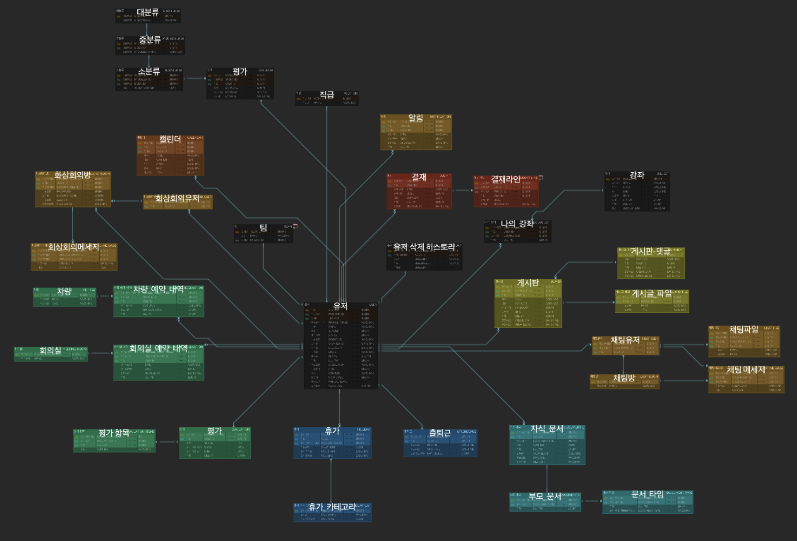
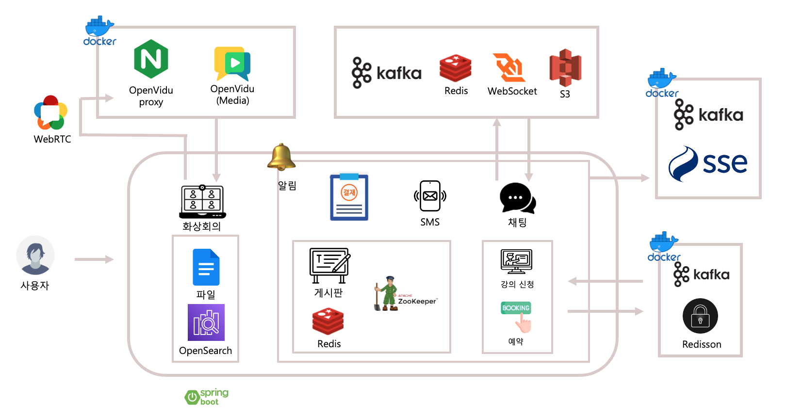
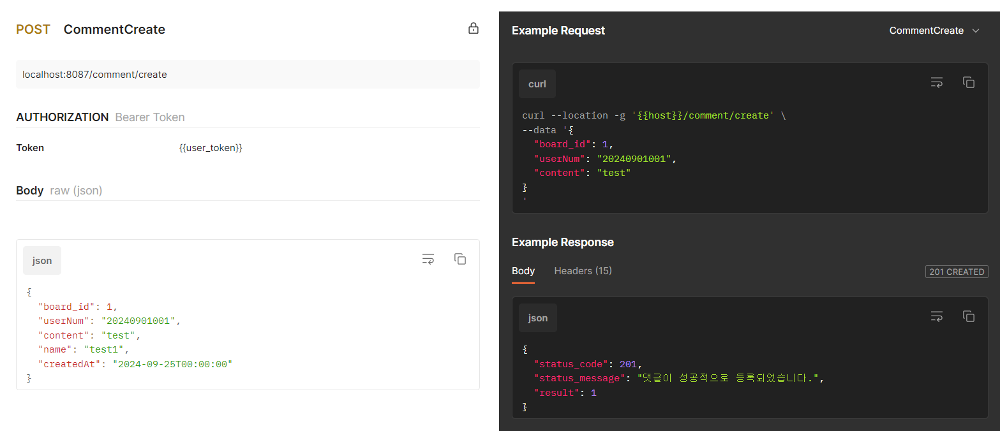
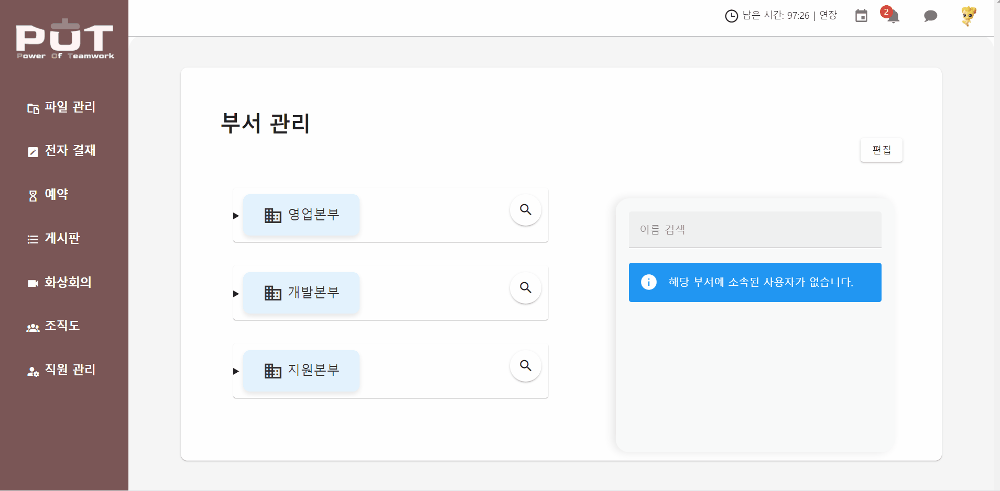

    

 

## 🙋🏻팀원

| **이예나** | **김수연** | **박수현** | **이명규** | **황요한** |
| :------: |  :------: | :------: | :------: | :------: |
| [   @Ki-Wing](https://github.com/Ki-Wing) | [   @sueroku](https://github.com/sueroku) | [   @34suuuuu](https://github.com/34suuuuu) | [   @leem5514](https://github.com/leem5514) | [   @snikuz12](https://github.com/snikuz12) 

 

## 📢 프로젝트 개요

사원들이 보다 효율적으로 업무를 수행할 수 있도록 회사 내 자체 웹 기반 HR 솔루션을 개발하는 것을 목표로 합니다.

근태 관리, 문서 결재와 공용 파일 버전 관리, 공간 및 차량 대여, 내부 게시판 서비스를 통합하여 비대면 업무 환경에서의 효율성을 크게 높입니다. 각 부서와 직원간의 협업과 승인 절차를 한 번의 클릭으로 연결해 줌으로써 업무의 흐름을 최적화합니다. 

또한 실시간 채팅과 화상 회의를 가능하게 함으로써 사용자는 별도의 외부 시스템을 이용하지 않고도 회사 내부의 모든 HR 관련 절차를 처리할 수 있습니다. 

 

## 📈 요구 사항 정의서

 

[요구 사항 명세 보기](https://docs.google.com/spreadsheets/d/1VqdbBtMBag14rsCLODUl4LLlspbeZv8nNFEQy_W30PI/edit?gid=0#gid=0)

 

## 📝 WBS

 

[WBS 보기](https://docs.google.com/spreadsheets/d/1VqdbBtMBag14rsCLODUl4LLlspbeZv8nNFEQy_W30PI/edit?gid=1214013363#gid=1214013363)

## 🧱 ERD

 

[ERD 보기](https://www.erdcloud.com/d/cw7ygowDortnpZa2h)

 

## 📄 API 명세서

 

[API 명세서 보기](https://docs.google.com/spreadsheets/d/1VqdbBtMBag14rsCLODUl4LLlspbeZv8nNFEQy_W30PI/edit?gid=234323063#gid=234323063)

 

## ⚙️ 시스템 아키텍쳐

## ⚙️ CI/CD 시스템 아키텍쳐

 

## 📌 API 단위 테스트 결과서(주요기능)

[API 단위 테스트(세부기능)](https://documenter.getpostman.com/view/38441114/2sAXxLDEz5)

로그인

### 일반 로그인

### 관리자 로그인

직원 관리

### 직원 등록

### 직원 상세 조회

### 직원 정보 수정

### 직원 정보 조회

출/퇴근 관리

### 출근

### 퇴근

게시판 관리

### 게시물 작성

### 게시판 상단 고정

### 게시판 세부 조회

### 게시판 조회

댓글 관리

### 댓글 생성

### 댓글 수정

문서 관리

### 문서 등록

### 문서 업데이트

### 문서 히스토리

### 전체 문서 조회

### 최근 수정 문서

### 최근 열람 문서

결재 관리

### 결재 생성

### 결재 승인 및 거절

부서 관리

### 부서 목록 조회

### 부서 계층 변경

ES 문서 관리

### ES 문서 검색

### ES 인덱싱 생성

 

## 🖥️ UI/UX 단위 테스트 결과서

  

로그인

### 로그인

  

마이페이지

### 근태 관리

### 인사 평가

  

파일 관리

### 파일 등록

### 댓글 작성

### 파일 버전 관리

  

전자 결재

### 결재 요청

### 결재 승인/반려

  

예약

### 회의실 예약

### 법인 차량 예약

  

게시판

### 공지사항

### 질의 응답(Q&A)

### 강의 리스트

  

화상 회의

  
### TDB

  

직원 관리

### 직원 생성

### 직원 정보 수정

  

급여 관리

  
### 급여 명세서 조회(세금)

### 급여일 설정

  

일정 관리

### 일정 생성

  

부서 관리

### 부서 계층 조회

### 부서 추가

### 부서 이동

  

채팅

### 채팅방 생성

### 실시간 채팅

### 참여자 초대/나가기

달력

### 권한 별 일정 등록

## 💡 배포 결과서

  

파일 등록

### 파일 버전 업데이트 및 해당 파일에 대한 댓글 작성

### 파일 버전 되돌리기

  

일정 등록

### 급여일, 인사평가에 대한 일정 공용 캘린더에 등록

  

채팅

### 실시간 채팅

  

화상 회의

 

  

결재 + 게시판

### 결재 승인 후 게시판 업로드 및 문자 전송

### 결재문자

